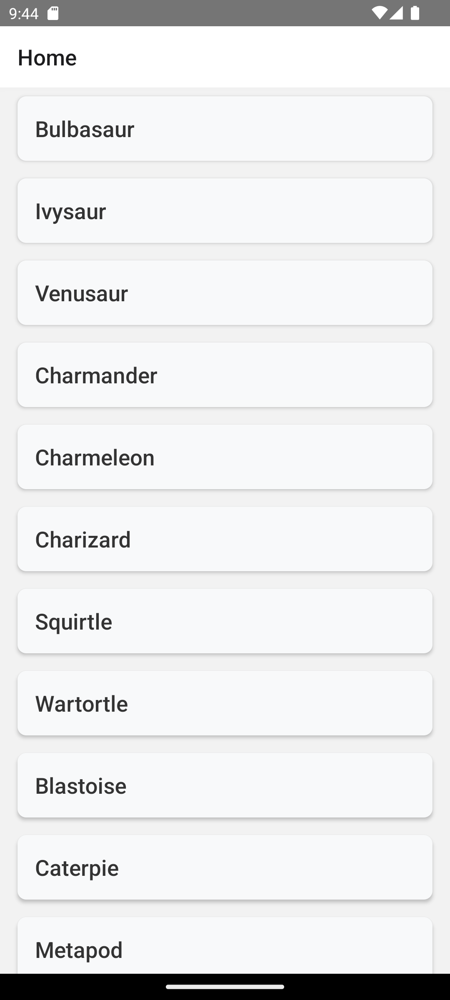
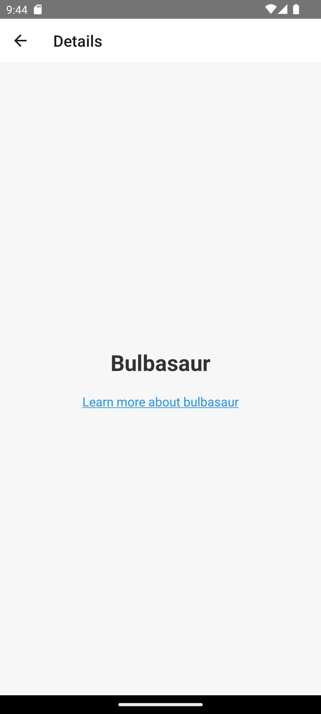
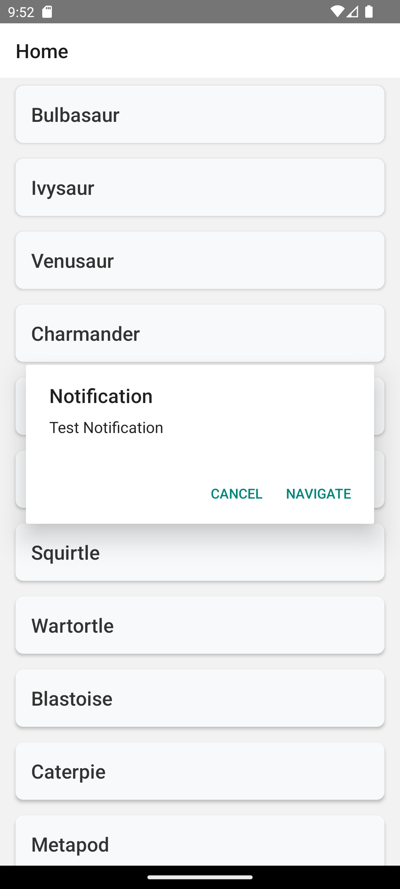
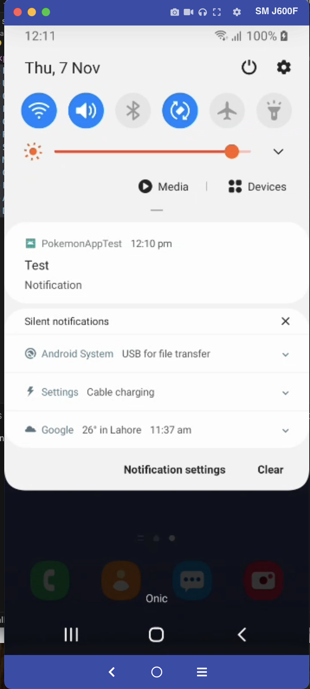
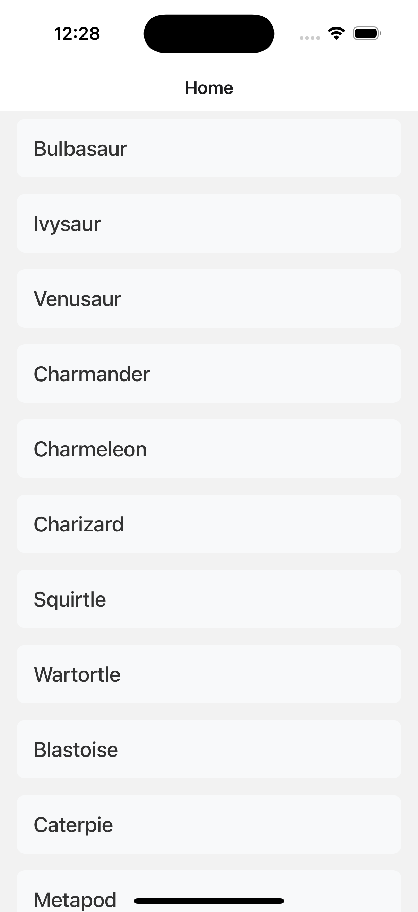
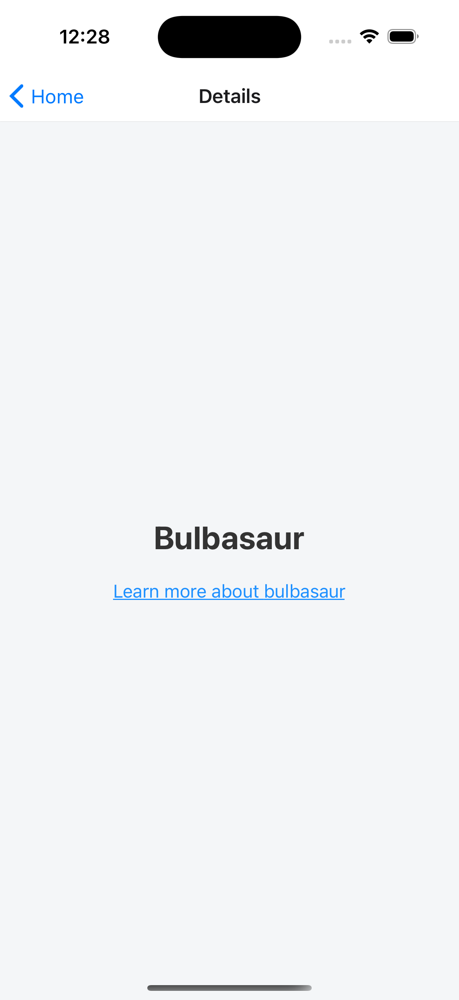

# Pokémon App with FCM and React Query

This React Native app demonstrates how to build a Pokémon app with Firebase Cloud Messaging (FCM) notifications, data fetching with React Query, and navigation with React Navigation.

## Table of Contents

Prerequisites
Installation
Firebase Setup
Running the App
App Structure
Usage

## Prerequisites

1. Node.js: Ensure you have Node.js installed (version 18.x or later is recommended).
2. React Native CLI: Follow the React Native environment setup instructions for your operating system.
3. Firebase Account: Create a Firebase project for FCM setup.

## Installation

1.  npm install
2.  cd ios (For IOS)
3.  pod install

## Firebase Setup

1.  Go to Firebase Console and create a new project.
2.  Add an Android and iOS app to this Firebase project. Follow the steps below for each platform.

## Running the App

1.  npx react-native run-android(for android)
2.  npx react-native run-ios (for ios)

## App Structure

pokemon-app/
├── src/
│ ├── api/
│ │ └── pokemon.ts # API calls for fetching Pokémon data
│ ├── firebase/
│ │ └── notificationHandler.ts # Firebase FCM handling
│ ├── navigation/
│ │ ├── MainNavigator.ts # Main navigation setup
│ │ └── types.ts # Type definitions for navigation
│ ├── screens/
│ │ ├── HomeScreen # Home screen with Pokémon list
│ │ └── DetailsScreen# Pokémon details screen
│ └── App.tsx # Root component
├── App.tsx # App entry point
└── README.md

## Usage

1. Pokémon List: The Home screen displays a paginated list of Pokémon. Scroll down to load more.
2. Notification Navigation: When a notification is received, click "Navigate" to go to the details screen with data from the notification (For android only).

## Screenshots

